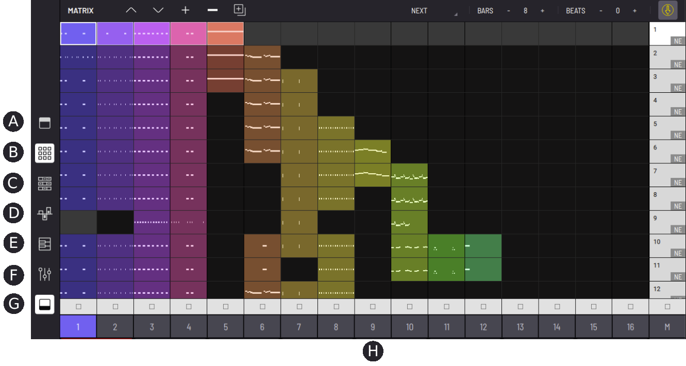
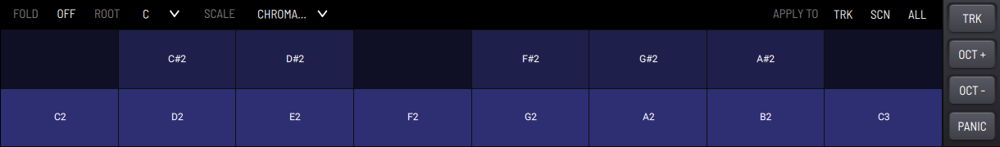

# Interface overview

BAM is a groovebox style application ready for full autonomous music
production. It comes with sound engines, effects units, a mixer, various
panels for MIDI clips and automation editing as well as a factory
soundbank.

BAM’s interface consists of a fixed horizontal toolbar across the top, a
dynamic three-section main work area, and a fixed horizontal toolbar
across the bottom.

## Top toolbar

- **(A)** Menu icon - open BAM’s menu
- **(B)** MIDI learn - activate MIDI mapping mode and select highlighted controls to map to connected MIDI devices
- **(C)** Clock source (standalone app only) - choose between internal, external MIDI Clock, or Ableton Link
- **(D)** Toggle metronome
- **(E)** Tempo - set project tempo, adjust the metronome volume and configure MIDI clock
- **(F)** Project - open project manager to manage and load projects
- **(G)** Create new project
- **(H)** Save Project
- **(I)** Revert project to last manually saved state
- **(J)** Load previous/next project in current bank
- **(K)** Open sample manager

### BAM Menu

- **Profile** - Login to Imaginando account
- **Store** - Manage expansions
- **MIDI** (Standalone app only) - enable/disable available MIDI in/out ports
- **Controllers** - Manage external MIDI controllers with built-in support
- **Settings**
    - **Audio Driver** (Windows standalone app only) - select ASIO or WASAPI drivers
    - **Output Audio Device** - Select output audio device
    - **Input Audio Device** - Select input audio device
    - **Input Audio Channels** - Select input channel configuration
    - **Sample rate** - Select sample rate
    - **Buffer size** - Select audio buffer size
    - **Window scale** (Desktop only) - Resize BAM UI size/scale
    - **Background Audio** (iOS only) - Enable background audio
    - **Notifications** (iOS only) - Enable push notifications
- **About** - Details about app version number, publisher, and production credits
- **Help** - Open BAM´s user manual in a web browser

## Top Section - Device rack

- **(A) Trigger** - Note properties for created steps
- **(B) MIDI Effects** - Effects processing for incoming MIDI (up to three per track)
- **(C) Modulators** - Modulator engines (EG and LFO) (up to two per track)
- **(D) Engine** - Synthesis source/generator of the tracks
- **(E) Effects** - Effects processing for incoming audio (five available per track)
- **(F) Mixer** - Mixer parameters

## Middle Section - Main panels

In this section we have the panels for:
- **(A) Matrix** - MIDI Clip and Scene launcher
- **(B) Timeline** - Step Sequencer
- **(C) Automations** - Clip-based parameter step-modulation editor
- **(D) Composer** - Piano roll MIDI clip editor
- **(E) Mixer** - 16 track mixer plus master and return
- **(F) Track Selection**

## Lower Section - Performance area

There are 16 pads which trigger the default note of each track´s engine,
and provide a visual representation of each track’s audio in real time.

To the right there are four toggle buttons that, when active, perform the
following actions:
- **KBD** - Switch to keyboard mode (see below)
- **SOLO** - Select tracks to solo
- **MUTE** - Select tracks to mute
- **ARM** - Select tracks to arm for performance and recording

Tip: You can SOLO/ARM multiple tracks by using the SHIFT keys located at
the bottom left and right of BAM’s interface:

On desktop you can use the shift keys of your computer keyboard to
activate SHIFT function.

## Keyboard mode

Keyboard mode changes the pads into note triggers for the currently
selected track, arranged like piano keys. With SHIFT active you
can drag the keyboard horizontally to scroll the available notes, and
drag vertically to zoom/resize the keys. While Keyboard mode is active
the toggle buttons change accordingly:

- **TRK** - Switch back to pad trigger mode
- **OCT +** - Raise the values of all note triggers by one octave
- **OCT -** - Lower the values of all note triggers by one octave
- **PANIC** - Send note off messages to all notes

## Bottom toolbar

The bottom toolbar consists of several different functions:

- **(A) Shift button** - Provides additional functions for some tools when active
- **(B) DSP usage meter** - Displays the current level of DSP usage
- **(C) Show/hide top section** - Expands and minimizes the upper and lower sections
- **(D) Undo/Redo button** - Undo/redo the last performed action
- **(E) Transport buttons**
    - **Play button** - Start project playback
    - **Stop button** - Stop project playback
    - **Record button** - Enables recording for armed track(s)
- **(F) Automation buttons**
    - **Automation record mode** - Toggle between Latch and Touch modes
    - **Re-enable automations** - This is used for reactivation of an existing step automation, when manual operation of parameters has temporarily overwritten the automation in currently playing clips
- **(G) Export menu** - See [Export menu](export-menu)
- **(H) MIDI mapping manager** - See [MIDI mappings](midi-mappings)
- **(I) Preferences menu** - See below
- **(J) Shift button** - Provides additional functions for some tools when active

Note: When using BAM AUv3 plugin in an iOS host DAW, the top and bottom sections cannot both be displayed at the same time. Expanding either section will automatically hide the other.

## Preferences menu

### General

- **Open Engine windows by default** - When adding a new engine or changing an existing engine to a different type, if this setting is active, the new engine window will always automatically open.
- **Recording Countdown** - The number of ‘count in’ bars before recording starts each time the record button is pressed.
- **Always select master track when selecting mixer** - When active, switching to the MIXER panel will automatically select the master track.
- **Auto add engine parameters to automations list** - When active, adding a new engine will automatically add all of its parameters to the automations panel list.
- **Auto select tracks when pressing pads** - When active, clicking any of the track pads automatically selects that track.
- **Arm track on selection** - When active, selecting any track will automatically arm it (and unarm any other currently armed tracks).
- **Autosave Frequency** - Enables auto saving of the project state, based on a regular time interval in minutes (a choice of 1, 2, 5 or 10 minute intervals), or disables auto save when set to ‘off’.
- **Interaction Axis** - Choose axis for knob interaction.

### Performance

- **Trigger Quantization** - The time period that triggering a clip or scene synchronizes to. Sometimes referred to as onset timing correction of
triggering.
- **Recording Quantization** - When recording MIDI notes they will automatically quantize (snap) to the closest note position to the specified note length division. When set to off, no quantization is applied.
- **Select clip on trigger** - When active, triggering a clip will also select it.
- **Select clips when scene is triggered by follow action** - When active, any scene triggered by a follow action will automatically select all of the scene’s clips when playback of the scene commences.
- **Change clip properties on beat time** - When active, changes to properties of the clip that can be changed on the TIMELINE and AUTOMATIONS panel will be synchronized to the beat.
