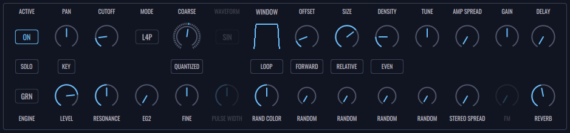

# Control Panel

- **ACTIVE Button** (Global) - Activate or deactivate current layer.

- **SOLO Button** (Global) - Solos the current layer. This is an exclusive button, so, when soloing a layer, it will unsolo any previous soloed one.

- **ENGINE Button** (Global) - Selection of layer engine. Layer can be an oscillator or granulator.

  ### Oscillator Mode

  Despite the main focus of FRMS being the granular engine, it is possible to use each layer as an oscillator source. Subtractive synthesis is based on the sculpting of rich and complex waveforms, through the process of filtering and modulation. The name of subtractive comes from the fact that we start with full spectral waveforms, and we can manipulate them with the removal of its harmonic content, generating different timbral sounds all coming from the same source. With this in mind, we offer 4 kinds of waveforms:

  - **Sinusoidal** - The simplest and purest waveform. A sinusoidal is composed with only a single fundamental, having no harmonics.
  - **Sawtooth** - This waveform is the richest classic periodic waveform because it is composed of all harmonics of its fundamental.
  - **Square and Triangle** - These two waveforms is composed only be odd harmonics

  ### Granulator Mode

  **_A complex sound may be imagined as a multicolored firework in which each point of light appears and instantaneously disappears against a black sky … A line of light would be created by a sufficiently large multitude of points appearing and disappearing instantaneously. (Xenakis 1992 pp. 43-44)_**

  Granular synthesis consists of combining a large number of tiny audio units (grains) over time, resulting in complex sound structures. Despite the origins of this concept being theoretically present way back, it was only after Dennis Gabor and Iannis Xenakis experiments that this kind of synthesis became more well funded. Then, Curtis Roads took granular concepts and applied them with computational models and we were left with a completely new kind of sound synthesis, capable of new timbres and sonic atmospheres.

  With granular, instead of playing a sound file in a continuous linear way, we can divide that same sound file into thousands of micro pieces, modify them (pitch, amplitude and duration) and reorganize them in any way we want. Then we can play them individually at any rate, ranging from slow reading (generating discrete, noisy sounds), to very fast reading (generating very dense sonic atmospheres). From a single audio file we can generate a multitude of sounds with different characteristics, maintaining more or less the timbral characteristics of the original file or even creating completely new and original sounds that have no resemblance with its source.

  This synthesis offers a lot of control to the user, since we’re dealing with individual grains, each one having its characteristics. Modifying one parameter can have a huge effect on the overall sound.

  This kind of engine is the main focus of FRMS so there are plenty of granular controls and a lot of sound files to choose from. Simplicity and clarity was accounted for, so the controls are all visible (through buttons and knobs) and the granular gains are being graphically displayed so there’s a visual representation of what's creating the sound.

- **PAN Knob** (Global) - Controls panning.

- **KEY/FREE Button** (Global) - In Key mode, the sound’s pitch is related to the pressed notes. In Free mode, the sound’s pitch is only related to the layer’s tune knobs.

- **LEVEL Knob** (Global) - Controls the volume of the layer.

- **CUTOFF Knob** (Global) - Controls the cutoff of the layer filter.

- **RESONANCE Knob** (Global) - Controls the resonance of the layer filter.

- **MODE Button** (Global) - Selects the layer filter mode. Filter can be a 4 pole low-pass, 2 pole low-pass, high-pass, band-pass and notch.

- **EG 2 Knob** (Global) - Controls the amount of modulation being applied to filter cutoff by the EG2.

- **COARSE** (Global) - Selects the tuning of the layer. It has a range of -3/+3 octaves and can be used as a quantized of free knob.

- **QUANTIZED/FREE Button** (Global) - Selects the behaviour of the coarse knob. When in quantized mode, coarse works with fix steps of 1 semitone. In free mode there’s no fixed steps.

- **FINE Knob** (Global) - Controls the fine tuning of the layer.

- **WAVEFORM Button** (Oscillator) - Selects the type of oscillator. Wave can be **Sinusoidal (sin), Triangular (tri), Sawtooth (saw) and Square (sqr)**.

- **PULSE WIDTH** (Oscillator) - Controls the square wave pulse size if the wave type is square ("sqr").

- **Window Interactive Zone** (Granulator) - Controls the shape of grain's window.

- **MODE Button** - Selects the playing mode of the grains.

  - **LOOP** - Grains are being looped on selection.
  - **P.PONG** - Grains go back and forth on selection.
  - **END** - Grains stop when reach the end of the selection.

- **RAND COLOR Button** (Granulator) - Controls the the way random knobs works.

- **OFFSET Knob** (Granulator) - Controls grain's starting point.

- **Playing Mode Button** (Granulator) - Selects grain's reading behaviour.

  - **Forward** - Grain is read from the beginning to the end.
  - **Backward** - Grain is read from the end to the beginning.

- **RANDOM Offset Knob** (Granulator) - Controls the amount of random applied to the grain starting point. Random is applied everytime a grain is started.

- **SIZE Button** (Granulator) - Controls the amount of grain size.

- **Size Mode Button** (Granulator) - Selects the type of grain's size.

  - **Relative** - The amount of grain size is relative to the size of the sample.
  - **Absolute** - The amount of grain size is relative to a fixed value of 100 frames.
  - **Sync** - The amount of grain size is relative to the bpm.

- **RANDOM Size Knob** (Granulator) - Controls the amount of random applied to each grain size. Random is applied everytime a grain is started.

- **DENSITY Knob** (Granulator) - Controls the amount of grains that are being used.

- **Density Mode Button** (Granulator) - Selects the type of density.

  - **EVEN** - Grains are being fired evenly across the grain size.
  - **TIMED** - Grains are being fired with a fixed interval.
  - **SYNC** - Grains are being fired with an interval related to the bpm.

- **RANDOM Density Knob** (Granulator) - Controls the amount of random applied to density. Random is applied every time with the start of each grain.

- **TUNE Knob** (Granulator) - Controls the fine tuning of the pitch off all the grains.

- **RANDOM Tune Knob** (Granulator) - Controls the amount of random applied to each grain tune. Random is applied every time with the start of each grain.

- **AMP SPREAD Knob** (Granulator) - Controls the amount of random applied to each grain amplitude. This happens everytime a grain is started.

- **STEREO SPREAD Knob** (Granulator) - Controls the amount of random applied to each grain panning. This happens everytime a grain is started.

- **GAIN Knob** (Granulator) - Controls the amount of gain applied to the sample/input being used.

- **FM Knob** (Global) - Controls the amount of signal being sent as a Fm modulator. This is dependent of the fm mode being used in the global panel.

- **DELAY Knob** - Controls the amount of signal being sent to the delay module.

- **REVERB Knob** - Controls the amount of signal being sent to reverb module.

[See next how to use envelope panel.](envelope-panel)
