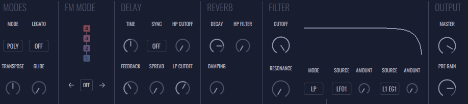
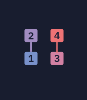
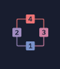
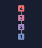
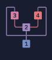
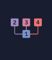
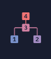
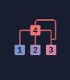
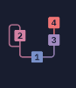

# Global Panel

In this panel you control settings that affect the overall synth performance and sound, such as: polyphony, FM, effects, global filter, master output. It is divided in 5 panels

 
 

### **Modes**

- **MODE** - Selects between voicing mode. It can be Poly, Mono or Unisson.
- **TRANSPOSE** - Can pitch up/down all layers simultaneously.
- **LEGATO** - Turns on/off legato.
- **GLIDE** - Defines the duration of the glide between notes. When at zero there’s no glide.

 

### **FM Modes**

**_A new application of the well-known process of frequency modulation is shown to result in a surprising control of audio spectra. The technique provides a means of great simplicity to control the spectral components and their evolution in time. Such dynamic spectra are diverse in their subjective impressions and include sounds both known and unknown. (Chowning 1973 The Synthesis of Complex Audio Spectra by Means of Frequency Modulation)_**

1973 was the year John Chowning released he’s paper about fm synthesis. There he stated that, despite being a known method for other applications, frequency modulation applied to sound could result in new rich sounds. With this synthesis method, one could even “replicate” other instruments using only sinusoidal waveforms.

Contrary to subtractive synthesis, which modifies the spectral content of an harmonic rich sound, fm synthesis creates new spectral content that is modulated over time, by modulating an oscillator’s frequency (carrier) with the output’s amplitude of other oscillator (modulator). With this, even using simple sounds as a sine wave, it is possible to create complex ones, because when applying frequency modulation, new side bands emerge, thus resulting in new timbres.

The relationship between the frequencies of modulator and carrier (also known as ratio) is what is going to define the quality of the resulting sound. If that relation is harmonic, it will result in an harmonic sound. Otherwise, if the relationship is inharmonic, the resulting sound will be inharmonic too. The more the modulator’s frequency is increased, the more the resulting sound complexity. This concept is very important, since this relation is what will define the type of the resulting sound (bell like sounds have a specific ratio while woodwind sounds have another).

It is possible to have a chain of frequency modulations, where for example, oscillator one modulates oscillator two, and the result of oscillator two will modulate oscillator 3. This is just an example since there are a lot of different layout possibilities depending on the amount of oscillators available and each of those oscillators can be called an operator. Since FRMS has a system with 4 independent layers, it is possible to think of each one as an operator. In FRMS case, an operator can not only be an oscillator, but also a granulator engine, turning everything even more interesting. There are 8 different layouts available and each operator, if working as a modulator, has an available FM knob to control the amount of amplitude being sent as a modulation signal.

FRMS has an FM engine that enables FM synthesis between the layers. Each layer functions as an individual operator with 8 different FM modes available that organizes the operators in different ways.

- **Operators Image** - Displays the current selected FM mode. When off, the image has opacity.
- **Left Arrow** - Selects the current FM mode in a decreasing order.
- **ON/OFF** - Enables/disables Fm engine.
- **Right Arrow** - Selects the current FM mode in an increasing order.

 

Available FM modes (each number corresponds to the layer number):

### **FX**

FRMS has two independent effect units connected as auxiliary channels. The amount of signal that is sent to these units is controlled with the DELAY and REVERB knobs that can be found in each layer.

### **Delay**

- **TIME** - Controls the amount of delay time.
- **FEEDBACK** - Controls the amount of feedback.
- **SYNC** - Enables/disables sync function. When on, delay time is in sync with the BPM.
- **SPREAD** - Controls the amount of stereo spread.
- **HP CUTOFF** - Controls the cutoff of the delay’s high pass filter.
- **LP CUTOFF** - Controls the cutoff of the delay’s low pass filter.

 

### **Reverb**

- **DECAY** - Controls the amount of decay.
- **DAMPING** - Controls the amount of damping.
- **HP FILTER** - Controls the cutoff of the reverb’s high pass filter.

 

### **Filter**

Master filter section. This is a lowpass/highpass filter that can be manipulated directly on the window where cutoff and resonance can be changed. This filter can be modulated by the LFO's and EG's.

- **CUTOFF** - Controls the cutoff of the master filter.
- **RESONANCE** - Controls the resonance of the master filter.
- **MODE** - Selects the type of filter being used. It can be a lowpass (LP) or highpass (HP) filter.
- **SOURCE** - Selects the first source of modulation. It can be LFO 1 or LFO 2.
- **AMOUNT** - Selects the amount of modulation being applied by first source.
- **SOURCE** - Selects the second source of modulation. It can be EG1 or EG2 of any layer. The “L” represents the number of the layer, so for example, when selecting “L1EG1” the EG1 of the first layer is being chosen to be the second source.
- **AMOUNT** - Selects the amount of modulation being applied by second source.

 

### **Output**

- **MASTER** - Master volume. Controls the overall level of the instrument.
- **PRE GAIN** - Controls the pre gain given to the overall sound.

 

[See next how to use performance modes.](performance-modes)
