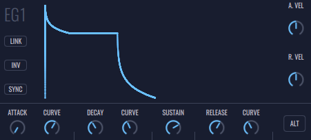
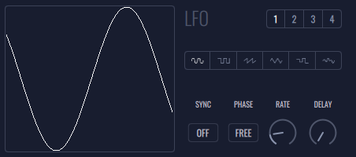
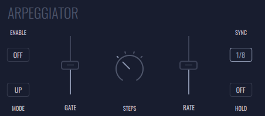

# Layers

This is the main controllable area of this instrument. FRMS consists of 4 layers that can be used simultaneously or individually. Each layer can be an oscillator or a granulator engines, and each one has a distinctive color so it can be easily recognizable. Each layer can be thought of as an instrument on its own, and they can be summed, of used as FM operators with each other.
Each layer has a top bar with functionalities on the left, and 6 panels on the right that gives access to extra functionalities.

On the left, next to “Layer” text there is:

- **1 | 2 | 3 | 4 Buttons** - This is the layer selector. The colored number represents the current selected layer.

- **Lock Icon** - When enabled, changing the selected layer will also change the other visible layer to the selected one.

- **COPY Button** - When pressed copies the selected layer properties. These properties can be pasted with the paste button. This button has the color of the actual copied layer.

- **PASTE Button** - When pressed, if there are any copied layer, copy its properties to the current selected layer. This button has the color of the copied layer.

On the right there are the following panels:

## **Waveform Panel**

This panel displays the waveforms and enables some global sound file operations

- **Waveform** - Changes the source being granulated. It can be a sample (Waveform) or it can be a live input (Input)

*In waveform mode there are the following options:*

- **1st Icon (Load)** - Opens the File Browser.

- **2nd Icon (Record)** - Records a sound from the input.

- **3th Icon (Cut)** - When there is a selection area in the waveform display, pressing cut will chop the wavefile in that selection. Cut can only be applied in files that aren’t from banks

- **4th Icon (Delete)** - Deletes the current loaded file

- **5th Icon (Copy)** - Copy file to be pasted on a different layer

- **6th Icon (Paste)** - If there's a copied sound file, pastes that file in the current layer

*In Input mode there are the following options:*

- **1/8** - Selects the size of the buffer being used to store live input information as a 1/8 of 2 seconds

- **1/4** - Selects the size of the buffer being used to store live input information as a 1/4 of 2 seconds

- **1/2** - Selects the size of the buffer being used to store live input information as a 1/2 of 2 seconds

- **1** - Selects the size of the buffer being used to store live input information as 1 second

- **2** - Selects the size of the buffer being used to store live input information as 2 seconds

- **FREEZE** - Freezes the actual buffer information

- **STEREO/MONO** - This button sets how to record a file from input. It can be recorded as a stereo or mono file

- **Audio Device Selection (only available in desktop version)** - Selects the audio device being used as input

Below these buttons there is a panel which displays the current layer’s audio file’s waveform (in case we are in granulator mode) or the waveform being generated (in case we are in oscillator/input mode). This is the zone where a selection can be made to use with crop functionality.

## **Control Panel**

- **ACTIVE Button** (Global) - Activate or deactivate current layer.

- **SOLO Button** (Global) - Solos the current layer. This is an exclusive button, so, when soloing a layer, it will unsolo any previous soloed one.

- **ENGINE Button** (Global) - Selection of layer engine. Layer can be an oscillator or granulator.

- **PAN Knob** (Global) - Controls panning.

- **KEY/FREE Button** (Global) - In Key mode, the sound’s pitch is related to the pressed notes. In Free mode, the sound’s pitch is only related to the layer’s tune knobs.

- **LEVEL Knob** (Global) - Controls the volume of the layer.

- **CUTOFF Knob** (Global) - Controls the cutoff of the layer filter.

- **RESONANCE Knob** (Global) - Controls the resonance of the layer filter.

- **MODE Button** (Global) - Selects the layer filter mode. Filter can be a 4 - pole low pass, 2 pole low pass, high pass, band pass and notch.

- **EG 2 Button** (Global) - Controls the amount of modulation being applied to filter cutoff by the EG2.

- **COARSE** (Global) - Selects the tuning of the layer. It has a range of -3/+3 octaves and can be used as a quantized of free knob.

- **QUANTIZED/FREE Button** (Global) - Selects the behaviour of the coarse knob. When in quantized mode, coarse works with fix steps of 1 semitone. In free mode there’s no fixed steps.

- **FINE Knob** (Global) - Controls the fine tuning of the layer.

- **WAVEFORM Button** (Oscillator) - Selects the type of oscillator. Wave can be  **Sinusoidal (sin), Triangular (tri), Sawtooth (saw) and Square (sqr)**.

- **PULSE WIDTH** (Oscillator) - Controls the square wave pulse if the wave type is "sqr".

- **Window Interactive Zone** (Granulator) - Controls the shape of grain's window.

- **MODE Button** - Selects the playing mode of the grains.
    - **LOOP** - Grains are being looped on selection.
    - **P.PONG** - Grains go back and forth on selection.
    - **END** - Grains stop when reach the end of the selection.

- **RAND COLOR Button** (Granulator) - Controls the the way random knobs works.

- **OFFSET Knob** (Granulator) - Controls grain's starting point.

- **Playing Mode Button** (Granulator) - Selects grain's reading behaviour.
    - **Forward** - Grain is read from the beginning to the end.
    - **Backward** - Grain is read from the end to the beginning.

- **RANDOM Offset Knob** (Granulator) - Controls the amount of random applied to the grain starting point. Random is applied everytime a grain is started.

- **SIZE Button** (Granulator) - Controls the amount of grain size.

- **Size Mode Button** (Granulator) - Selects the type of grain's size.
    - **Relative** - The amount of grain size is relative to the size of the sample.
    - **Absolute** - The amount of grain size is relative to a fixed value of 100 frames.
    - **Sync** - The amount of grain size is relative to the bpm.

- **RANDOM Size Knob** (Granulator) - Controls the amount of random applied to each grain size. Random is applied everytime a grain is started.

- **DENSITY Knob** (Granulator) - Controls the amount of grains that are being used.

- **Density Mode Button** (Granulator) - Selects the type of density.
    - **EVEN** - Grains are being fired evenly across the grain size.
    - **TIMED** - Grains are being fired with a fixed interval.
    - **SYNC** - Grains are being fired with an interval related to the bpm.

- **RANDOM Density Knob** (Granulator) - Controls the amount of random applied to density. Random is applied every time with the start of each grain.

- **TUNE Knob** (Granulator) - Controls the fine tuning of the pitch off all the grains.

- **RANDOM Tune Knob** (Granulator) - Controls the amount of random applied to each grain tune. Random is applied every time with the start of each grain.

- **AMP SPREAD Knob** (Granulator) - Controls the amount of random applied to each grain amplitude. This happens everytime a grain is started.

- **STEREO SPREAD Knob** (Granulator) - Controls the amount of random applied to each grain panning. This happens everytime a grain is started.

- **GAIN Knob** (Granulator) - Controls the amount of gain applied to the sample/input being used.

- **FM Knob** (Global) - Controls the amount of signal being sent as a Fm modulator. This is dependent of the fm mode being used in the global panel.

- **DELAY Knob** - Controls the amount of signal being sent to the delay module.

- **REVERB Knob** - Controls the amount of signal being sent to reverb module.

## **Envelope Panel**

This is the envelope panel. There are two independent envelopes that can be used. EG1 is used to shape the sound, and both can be used as modulators
Both have the same parameters to be controlled.

- **LINK Button** - When active, the two egs are linked, so changes made affects both of them.

- **INV Button** - This button inverts the shape of the Eg vertically.

- **SYNC Button** - When on, EG values are relative to the bpm.

- **ATTACK Knob** - Controls the attack time of the envelope.

- **CURVE Knob** - Controls the type of curve being applied to the attack stage.

- **DECAY Knob** - Controls the decay time of the envelope.

- **CURVE Knob** - Controls the type of curve being applied to the decay stage.

- **SUSTAIN Knob** - Controls the sustain amount of the envelope.

- **RELEASE Knob** - Controls the release time of the envelope.

- **CURVE Knob** - Controls the type of curve being applied to the release stage.

- **ALT Button** - When pressed, this button switches the curve buttons to MAX buttons.

- **MAX Knob** - Controls the maximum time that can be applied to the envelope parameter laying on it's left.

- **A.VEL Knob** - Controls the amount of modulation being applied to the attack stage by velocity value.

- **R.VEL Knob** - Controls the amount of modulation being applied to release stage.

The panel with the drawed Eg can be manipulated directly. It's possible to change the attack, decay, sustain, release, and the respective curve by making left/right and up/down movements.

## **Matrix Panel**

This is the matrix panel of modulations. Here there are sources on the left that can modulate targets above. When clicking in a cell, it's value can be changed using the **Right Fader**. Each cell displays the amount of a source signal that is being applied to a target signal.

- **PAGE button** - Changes the page of the modulations, displaying different sources.

- **RESET button** - Clears all the modulations of the current layer.

### Sources:
- **PAGE 1** - LFO1, LFO2, LFO3, LFO4 EG1, EG2.

- **PAGE 2** - Sequencer (SEQ), Mod Wheel (MOD), Keyboard (KBD), Velocity (VEL) and After Touch (AFT).

### Targets: 
- Level, Pan, Cutoff, Resonance (RESO), Pitch, Fm, Offset, Size, Density, Stereo Spread (Str Spd), Amplitude Spread (Amp Spd), Random Offset (Rnd Off), Random Size (Rnd Size), Random Density (Rnd Dens), Random Tune (Rnd Tune), Pulse Width (PW)

## **Modifiers Panel**

This panel gives access to the Lfo's and the arpeggiator tabs.

### LFO
FRMS has two independent lfo's to be used as modulators

- **1/2/3/4 buttons** - Selects between the lfo 1, 2, 3 and 4.

- **Lfo Type Buttons** - Selects the waveform of the lfo. From the left to the right: Sinusoidal, Square, Sawtooth, Triangular, Sample and Hold (S&H), Filtered Sample and Hold (FS&H).

- **SYNC Button** - When enable the lfo frequency is synced with the BPM.

- **PHASE Button** - Selects the behaviour of the lfo when pressing a key.
    - FREE - The lfo is always running.
    - Key - The lfo phase is restarted when a key is pressed. This way the lfo will have the same behaviour every time a key is pressed.

- **RATE Knob** - Controls the lfo frequency.

- **DELAY Knob** - Controls the amount of time the lfo is delayed before starting.

### Arpeggiator

- **ENABLED Button** - Enables/disables arpeggiator.

- **MODE Button** - Selects the arpeggiator playing mode.
    - UP - Notes are played from the lowest to the highest pitch.
    - DOWN - Notes are played from the highest to the lowest pitch.
    - UP/DWN I - Notes are played from the lowest to highest pitch, and back to the lowest pitch.
    - UP/DWN II - Equal to up/dwn I, but the lowest and highest notes are repeated every time direction is changed.
    - RND - Notes are played randomly.

- **GATE Slider** - Controls the duration of the notes being played. The least the gate, the least the duration and vice-versa.

- **STEPS Knob** - Selects the amount of octaves being added to the arp notes. If steps are equal to 0, the arpeggiator only plays pressed notes. When steps is greater than 0, arpeggiator plays pressed notes plus that same notes in the octaves above (according to its amount).

- **RATE Slider** - Controls the speed of the arpeggiator.

- **SYNC Button** - When enabled, arpeggiator speed is sync with the BPM.

- **HOLD Button** - When enabled, arpeggiator memorizes the pressed notes, and keeps playing them even if there aren't any pressed notes.

## **Global Panel**

Has the overall controls of the instrument divided in 5 panels

### Modes
- **MODE Button** - Selects between voicing mode. It can be Poly, Mono or Unisson.
- **TRANSPOSE Knob** - Can pitch up/down all layers simultaneously.
- **LEGATO** - Turns on/off legato.
- **GLIDE** - Defines the duration of the glide between notes. When at zero there’s no glide.

### FM Modes
Frms has a fm engine that enables fm synthesis between the layers. Each layer functions as an individual operator with 8 different fm modes available that organizes the operators in different ways.

- **Operators Image** - Displays the current selected fm mode. When off, the image has opacity.
- **Left Arrow Button** - Selects the current fm mode in a decreasing order.
- **ON/OFF Button** - Enables/disables Fm engine.
- **Right Arrow Button** - Selects the current fm mode in an increasing order.

### Delay
Frms has a delay line functioning as an auxiliary track. Each layer can individually send a given amount of signal to the delay line that will sum to the overall output.

- **TIME Knob** - Controls the amount of delay time.
- **FEEDBACK Knob** - Controls the amount of feedback being applied to the delay.
- **SYNC Button** - Enables/disables sync function. When on, delay time is relative to the bpm.
- **SPREAD Knob** - Controls the amount of stereo spread given to the delay output.
- **HP CUTOFF Knob** - Controls the cutoff of the delay’s high pass filter.
- **LP CUTOFF Knob** - Controls the cutoff of the delay’s low pass filter.

### Reverb
Frms has a reverb line functioning as an auxiliary track. Each layer can individually send a given amount of signal to the reverb line that will sum to the overall output.

- **DECAY Knob** - Controls the amount of decay.
- **DAMPING Knob** - Controls the amount of damping.
- **HP FILTER Knob** - Controls the cutoff of the reverb’s high pass filter.

### Filter
Master filter section. This is a lowpass/highpass filter that can be manipulated directly on the window where cutoff and resonance can be changed. This filter can be modulated by the lfos and egs.

- **CUTOFF Knob** - Controls the cutoff of the master filter.
- **RESONANCE Knob** - Controls the resonance of the master filter.
- **MODE Button** - Selects the type of filter being used. It can be a lowpass (LP) or highpass (HP) filter.
- **SOURCE Button** - Selects the first source of modulation. It can be Lfo 1 or Lfo 2.
- **AMOUNT Knob** - Selects the amount of modulation being applied by first source.
- **SOURCE Button** - Selects the second source of modulation. It can be Eg1 or Eg2 of any layer. The “L” represents the number of the layer, so for example, when selecting “L1EG1” the Eg1 of the first layer is being chosen to be the second source.
- **AMOUNT Knob** - Selects the amount of modulation being applied by second source.

### Output
- **MASTER Knob** - Master volume. Controls the overall level of the instrument.
- **PRE GAIN Knob** - Controls the pre gain given to the overall sound.
