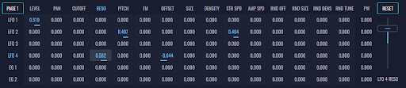

# Matrix Panel

This is the matrix panel of modulations. Here there are sources on the left that can modulate targets above. When clicking in a cell, it's value can be changed using the **Right Fader**. Each cell displays the amount of a source signal that is being applied to a target signal.

- **PAGE button** - Changes the page of the modulations, displaying different sources.

- **RESET button** - Clears all the modulations of the current layer.

### Sources:

- **PAGE 1** - LFO1, LFO2, LFO3, LFO4, EG1, EG2.

- **PAGE 2** - Sequencer (SEQ), Mod Wheel (MOD), Keyboard (KBD), Velocity (VEL) and After Touch (AFT).

### Targets:

- Level, Pan, Cutoff, Resonance (RESO), Pitch, Fm, Offset, Size, Density, Stereo Spread (Str Spd), Amplitude Spread (Amp Spd), Random Offset (Rnd Off), Random Size (Rnd Size), Random Density (Rnd Dens), Random Tune (Rnd Tune), Pulse Width (PW)

[See next how to use modifiers panel.](modifiers-panel)
