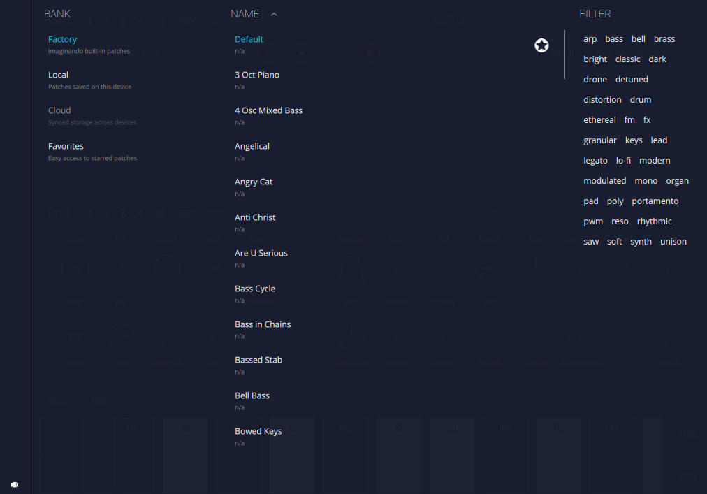
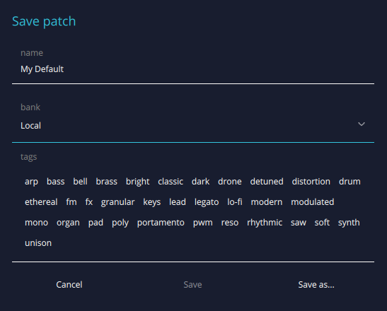

# Patches

The patch browser is divided in three columns: **Banks, Patches and Filter**.

The **Bank tab** will display the available banks at the time, each bank containing the patches. Since we release new patches over time, new banks can be added to this list.

- **Factory** - This bank stores the default presets included in FRMS.

- **Local** - This bank stores the presets saved by the user in the local machine.

- **Cloud** - This bank stores the presets saved by the user to the cloud. They can be accessed in every machine that has an internet connection and when the user has logged in. Bear in mind that in order to use this feature, users must have an imaginando account and be logged in. Cloud has a free plan and several paid ones each one with different available capacities. If users reach their current cloud plan limit, they won’t be able to save new patches to this bank.

- **Favorites** - This bank stores the favorite presets selected by the user. This works as a shortcut bank, since users can select patches as favorites and all of them will be available here. 
To do this just use the favorites icon:

    

In the other two columns there are:

- **NAME** - here will be displayed the patches that are contained on the selected bank, and they can be selected (by clicking on the desired one), deleted (by clicking on the right cross that appear when the patch is selected) or saved to the favorites bank (by clicking on the start icon).

- **FILTER** - Patches can be filtered by selecting the desired tags.

To save a patch just click the save patch icon:
 and the following panel will appear:

- **Cancel** - Exists the patch saving window without saving the patch

- **Save** - Overwrites the current patch. This is only available if the patch is different from its original state, or by changing the patch name.

- **Save as...** - Saves the current patch as a new patch with the specified name and in the specified bank

