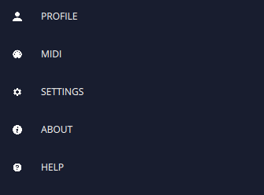

# Settings

On the upper left corner we have the settings icon  . When pressed it will open the settings sidebar.

- **PROFILE** - To use FRMS in the full feature mode, is it necessary to have an Imaginando account. Here is where the user login is made. If the user forgets its password, there is a “recover password” button that will help with the recovery. When the login has been made, user informations will appear, such as “licence status”, “email”, “name”, “genre”, “activity”, “age”, “country”, “website”, “facebook”, “soundcloud”, “twitter” and “youtube”.

- **MIDI** - Lists the current available midi devices. They can be selected or unselected to work in the current section

- **SETTINGS** - The program global settings. Regarding sound engine it is possible to select the audio device, sample rate and buffer size. Regarding midi, it is possible to select the midi in and out channels, turn **Midi Polyphonic Expression (MPE)** on/off, select the MPE pitch bend range, and choose if FRMS should send midi out. Also it is possible to turn on/off notifications, to select the number of voices that can be simultaneously played and the knobs sensitivity.

- **ABOUT** - Some information about the program such as version number, company name and people who contributed to the software.

- **HELP** - When pressed redirects the the product help page.
