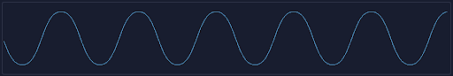

# Waveform Panel

This panel displays the waveforms and has two possible working modes:

- Oscillator mode example

    

- Granulator mode example

    

Depending on the layer engine mode, the following controls are available:

**Note 1**: All this options are disabled when engine is oscillator

**Note 2**: When layer engine mode is granulator, you can use this area to create a selection for the crop functionality (when applied).

_In waveform mode there are the following options:_

- **Waveform** - Toggles between waveform or live input mode

- **1st Icon (Load)** - Opens the File Browser.

- **2nd Icon (Record)** - Records a sound from the audio input.

- **3th Icon (Cut)** - When there is a selection area in the waveform display, pressing cut will crop the wavefile in that selection.

- **4th Icon (Delete)** - Deletes the current loaded file

- **5th Icon (Copy)** - Copy file to be pasted on a different layer

- **6th Icon (Paste)** - If there's a copied sound file, pastes that file in the current layer

_In Input mode there are the following options:_

- **1/8** - Selects the size of the buffer being used to store live input information as a 1/8 of 2 seconds

- **1/4** - Selects the size of the buffer being used to store live input information as a 1/4 of 2 seconds

- **1/2** - Selects the size of the buffer being used to store live input information as a 1/2 of 2 seconds

- **1** - Selects the size of the buffer being used to store live input information as 1 second

- **2** - Selects the size of the buffer being used to store live input information as 2 seconds

- **FREEZE** - Freezes the actual buffer information

- **STEREO/MONO** - This button sets how to record a file from input. It can be recorded as a stereo or mono file

- **Audio Device Selection (only available in desktop version)** - Selects the audio device being used as input

[See next how to use control panel.](control-panel)
