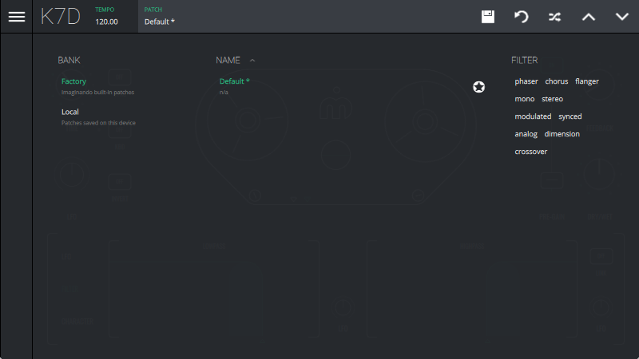

# Patches

Clicking on the patch name on the status bar opens the patch browser, which consists in three columns:

- **Bank** - Two available banks: **Factory** - patches created by Imaginando; **Local** - user created patches;

- **Name** - the list of available patches in the currently selected bank

- **Filter** - list of attribute 'tags' to filter the currently selected bank

To exit the patch manager, simply click the name of the currently selected patch on the menu bar again.

