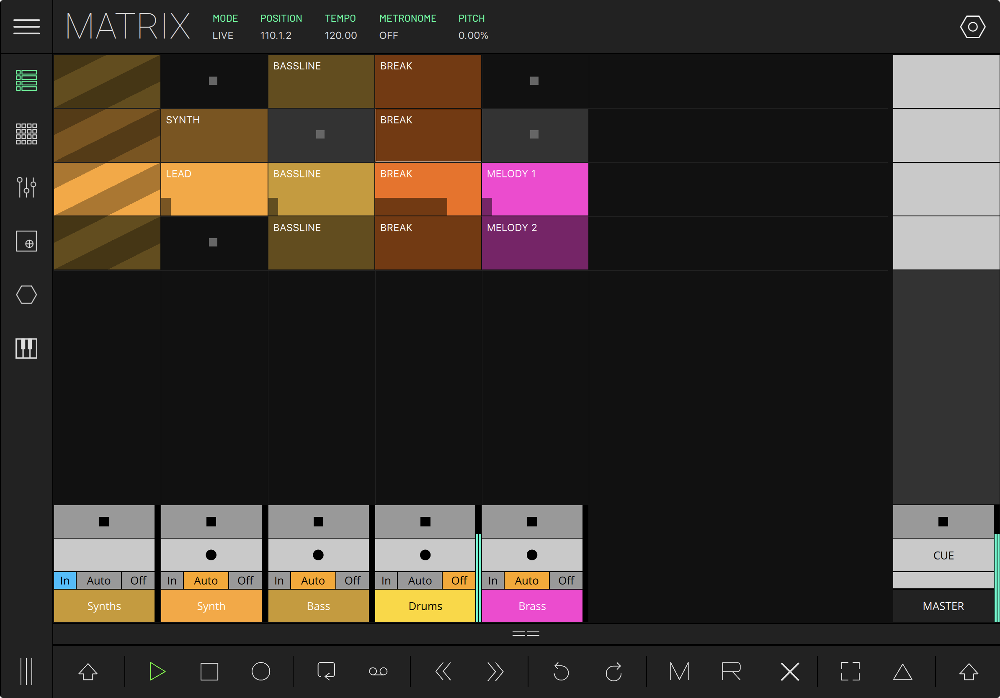
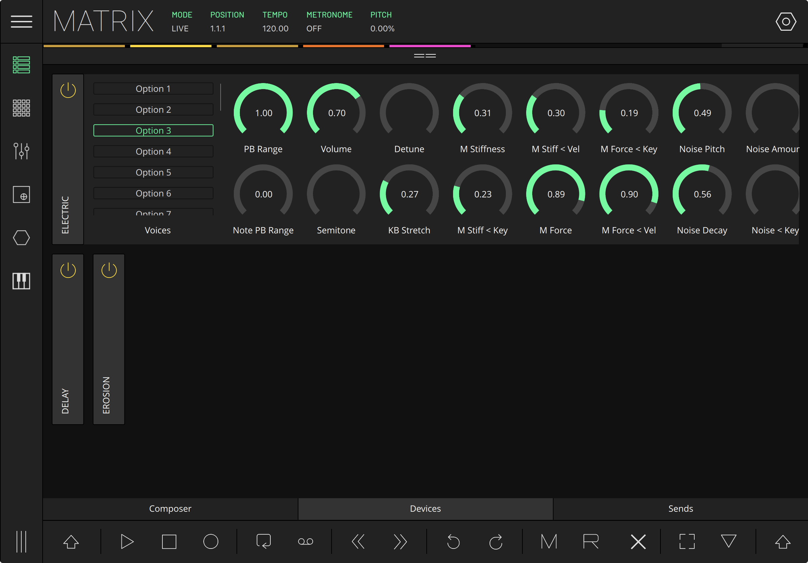
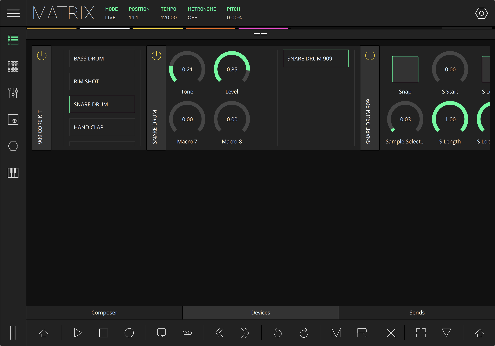
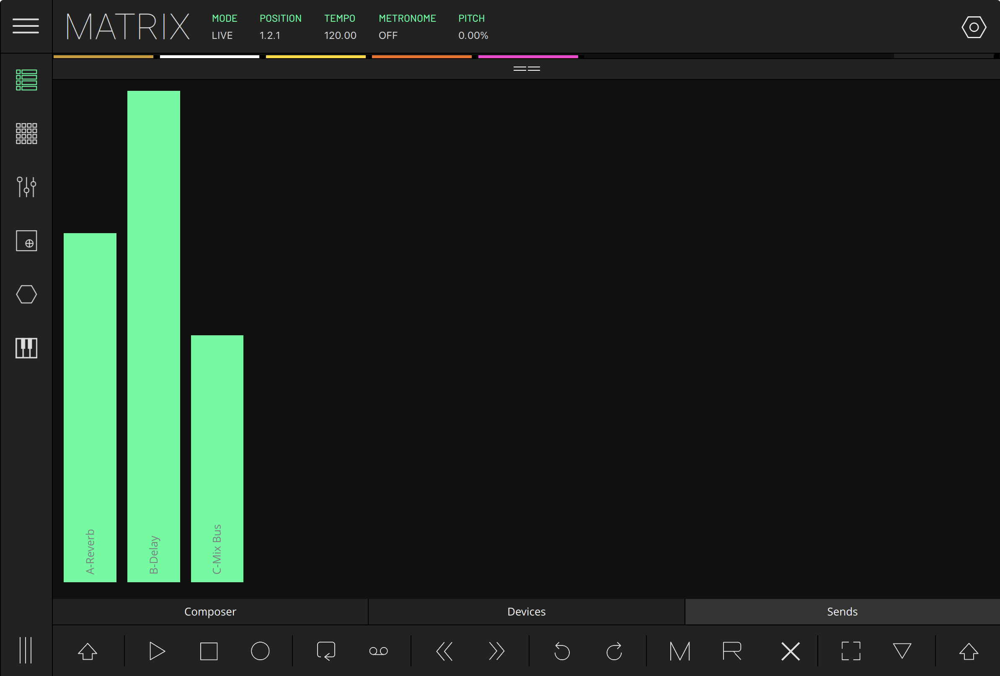
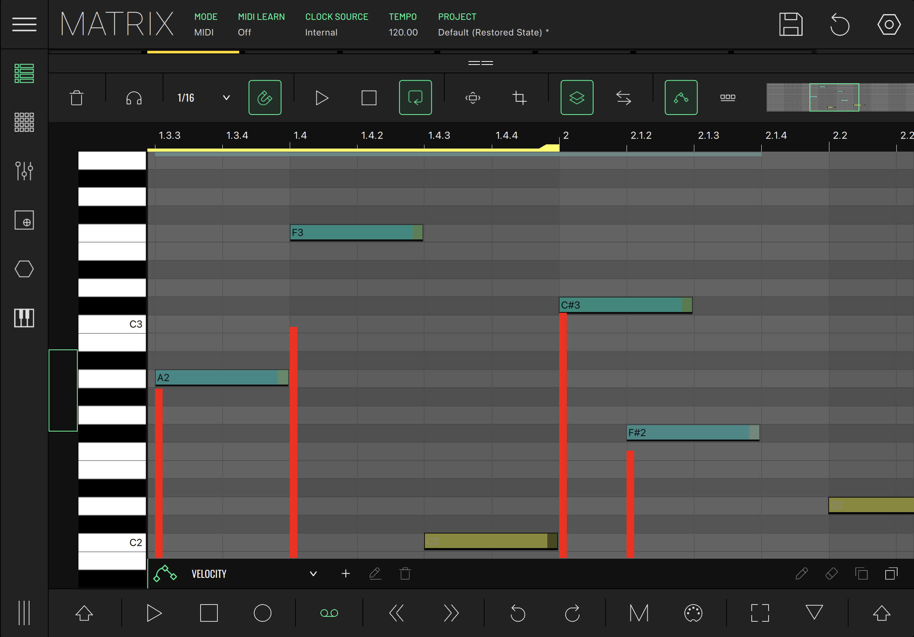

# MATRIX Module - LK Help

The Matrix module is a controller for Ableton Live and other MIDI software/hardware, carefully designed to give you access to the most common functions and operations for Ableton Live’s Session View (LIVE Mode), or for use with your mobile MIDI studio workflow (MIDI Mode). Tap LIVE or MIDI to toggle between modes. Ableton Live users please note: using Matrix requires the installation of LK control surface. For more information about how to install the LK control surface please visit the [Setup](setup) section.

The Matrix module is composed of several subsections and hidden menus, at the top of the screen, in the status bar, you will find the following fields:

- **MODE** - Toggle between LIVE and MIDI mode.
- **POSITION** (LIVE mode only) - shows the current arrangement position.
- **CLOCK SOURCE** (MIDI mode only) - Toggle between Internal, MIDI clock, and Link
- **TEMPO** - displays current session tempo and allows BPM adjustments
  In MIDI mode tapping tempo lets you also activate a built in metronome and send MIDI clock
- **METRONOME** (LIVE mode only) - controls Live's metronome sound on/off during playback or recording.
- **TRIGGER QUANT** - allows the adjustment of the clip triggering quantization.
- **REC QUANT** - allows the adjustment of the clip recording quantization.
- **PITCH** - displays the pitch value and toggles pitch slider visibility.
- **PROJECT** (MIDI mode only) - Opens the patch browser.
- **SAVE ICON** (MIDI mode only) - Saves the current patch.

## TRANSPORT CONTROLS MENU BAR

Across the bottom of the screen you will find the transport bar with the following icons/buttons (left to right):

- **PLAY** - starts playback.
- **STOP** - stops the playback.
- **RECORD** - sets the recording. In LIVE mode it also starts playback.
- **JUMP BACK** - rewinds the song position back by one beat.
- **JUMP FORWARD** - forwards the song position by one beat.
- **LOOP** (LIVE MODE) - toggles Ableton Live arrangement view loop function on or off
- **OVERDUB** - activates overdub recording on the currently armed clips.
- **UNDO/REDO** - tap to undo the last change/action (can be repeated for preceding commands), use with shift key modifier for redo.
- **MIXER** - hides or shows the mixer section.
- **INPUTS/OUT** (MIDI mode only) - Opens the input/output section of the tracks, allowing the selection of input and output device/channel.
- **RETURN** (LIVE mode only) - hides or shows the return tracks section on the Matrix module.
- **CROSSFADER** (LIVE mode only) - hides or shows the crossfader section on the Matrix module.
- **SHIFT** - alternates the function of certain buttons on the Matrix module. You can either hold shift, or double tap it to toggle on and off. Shift can be used to add, delete, duplicate and rename tracks and scenes. You’ll also be able to select clips without triggering them, and select multiple arm and solo buttons.

## Clip Grid

Occupying most of the screen is the clip grid of the Matrix module. In LIVE MODE, this view corresponds to Ableton Live session view.

It consists of tracks, scenes, clips, a transport bar across the bottom and an inspector zone that can be opened using the bar on the top of the transport zone. The inspector zone holds the devices and sends sections (in LIVE MODE) and the composer section.

It is possible to change the size of the clip grid by going to Settings menu on the Main Menu and adjusting accordingly to your preferences using the “Matrix Cell Size” field.

### Tracks

Tracks are displayed vertically, from left to right, each track occupying a single Matrix column, with the Master track on the right. The clip grid can be scrolled/navigated by dragging anywhere within the clip grip, except the Master track area.

Each track has a stop button that when pressed sends a stop message to that track’s active clip. It will stop accordingly to trigger quantisation, so everything stays in sync. Clicking on the stop button of the master track will stop all active clips.

You can add, remove, rename and duplicate tracks using the shift button. In LIVE MODE the track’s information will be linked with Ableton Live.

### Scenes

On the right side of the grid is the Master track which contains the scene launch buttons.

Tapping on a scene launch button triggers all the clips in that row.

Using the shift modifier button you can add, remove, rename and duplicate scenes by tapping a Matrix cell with a label showing three dots “...”

**Note for MIDI MODE:
When using MIDI mode, it is possible to choose the other LK modules as track inputs. This way you can record clips using the MIDI output of your desired modules.
If you’re using LK as an AUv3 unit, you can receive and send MIDI information in your tracks by using the “LK Input” and “LK Output” as your track’s input and output respectively.**

### Clips (MIDI mode)

To create a new clip you just need to DOUBLE TAP any empty grid cell (any cell containing a stop button).

You can also create one using the composer section.
Tapping a clip will trigger it, and it will start to play accordingly to the sessions trigger quantisation so that everything is in sync.
To select a clip without triggering it, use the shift modifier button.

LONG PRESSING a clip will open these clip options:

- **COPY** - copy all parameters of the current clip, so you can paste them in another slot
- **PASTE** - paste the currently copied clip into the selected slot
- **DELETE** - delete the clip
- **IMPORT MIDI** - Create a new clip from an external .mid file
- **PROPERTIES** - open the clip's properties

When a clip is playing, a solid rectangle along the bottom edge of the clip, represents the playing position of the clip, from left to right.

### Playing and recording clips

The clips on Matrix have the same behavior as the session clips on Ableton Live, meaning that tapping on an existing clip will play it, while tapping again on the clip will relaunch it. Similarly, tapping on the scene launch will trigger the corresponding row of clips and tapping it again will relaunch the exact same row.

The stop button for the clips or scenes can be found at the clips zone in the corresponding channel, represented by a black square on a grey background or as the first button of the Mixer.
If a track is armed on the Mixer section (either if it is a MIDI or an audio track), tapping on a blank clip will automatically create a new clip and start the recording process, while tapping on a pre-existing clip will record on said clip, depending if the overdub function is activated or not.

### Mixer

Tapping on the Mixer button (M icon) on the Transport bar menu shows/hides mixer controls for each track: Stop Clip, enable/disable track, Solo, Arm and select track.

To record notes into a clip it is necessary to turn on the track’s ‘Arm’ button and the record button in the transport bar. Remember that the shift button allows for non-exclusive selection of the Solo and Arm buttons.

When tapping the mixer icon, 3 buttons will appear in the master track (VOL, PAN, CUE). tapping on each one will open a slider for each track, that will let you control that track’s volume, panning and cue respectively.

LIVE MODE Notes: All changes on LK or Live will be mirrored: muting or soloing a track on Matrix will have effect in the Ableton Live session view and vice-versa.

Tapping the track label selects the respective track. Expanding the Inspector panel will open the channel’s subsection of devices, sends and the track Composer.

### Return Tracks (Live Mode)

When activating the return track, Ableton Live’s return tracks will appear on the left of the master track.
Just like the other tracks, you’ll be able to mute/solo and change its volume/pan.

### Inspector panel

Right above the transport bar there is a split view bar which allows the Inspector panel to be opened. This can be done by dragging the == icon, or tapping anywhere else inside the bar to instantly maximize/minimize. While in LIVE mode the Inspector panel consists of three parts:

- **DEVICES** (LIVE MODE) - allows browsing and editing of the selected track devices
- **SENDS** (LIVE MODE) - edit the selected track sends.
- **COMPOSER** - allows visualization and editing of the selected clip contents Tip: to get an enhanced experience using the Inspector panel, maximize it by tapping anywhere in between the two horizontal lines on the split view bar.

In MIDI mode, only Composer is shown.

- **DEVICES** - allows browsing and editing of the selected track devices
- **SENDS** - edit the selected track sends.
- **COMPOSER** - allows visualization and edit of the selected clip contents
  **Tip:** to get an enhanced experience using the Inspector panel, maximize it by tapping anywhere in between the two horizontal lines on the split view bar.

### Devices

The first tab of the Inspector panel is the Devices panel, which allows you to browse and tweak the selected Ableton Live track devices. Start by selecting a track with devices (if there are no devices available on the track, the tab will display a message). By default all devices appear collapsed.

When opened, the first device will fill the whole tab, while the next devices ahead will break to the next line. Drag the detail area up to scroll down and view the other devices.

Each device container is scrollable, allowing horizontal navigation of all the screen control parameters and subdevices. If the device has only a small set of parameters then the rest of the tab will be represented by empty space, except when the device has a device chain (i.e. a Drum Rack or Instrument Rack). Note: The option to ‘include chain’ must be enabled in LK settings. Let’s look at this example:

When browsing a Kit-Core 909 on Matrix you will see that this device has a device chain for each drumpad assigned. You will also see that the first parameters correspond to the chain instrument default parameters, followed by the list of devices on the chain, as represented on this image:

When you select a different device on the chain list, the selected device will be loaded to its right. You can access the respective device parameters by dragging the device label to the left. This browsing will give you theoretically unlimited access to your device chain. (Note: Your mobile device resources are not unlimited and excessive memory usage can make the operating system cause a forced shutdown to LK)

### Sends

The Sends tab lists the selected track sends. To change the send value, touch the slider and move it to the desired position.

## Composer

The Composer view displays a Piano Roll environment which allows you to edit the contents of the MIDI clips. Composer will always reflect the selected clip on the clip grid. The selected clip is the intersection between the selected track and select scene. On Live mode there are however a few exceptions, per instance, when you have a return track or the master track selected. In this case, composer will keep showing you the last selected clip. If that last position does not have a clip or the clip is audio, it will state that composer is not available.

The composer features a toolbar across the top with the following functions:

- **LISTEN** - determines if the MIDI note will be sent and heard when you touch the composer piano roll (track must be armed).
- **DELETE** - deletes the currently selected clip. (If there is no clip, this icon changes to a plus sign which when pressed will create a blank clip)
- **DUPLICATE** - duplicates the selected note or the selected group of notes.
- **SNAP ON/OFF** - toggles the grid snap on or off.
- **Q** - Quantizes the start of selected notes
- **GRID RESOLUTION** - Defines the resolution of the grid.
- **CLIP SIZE** - displays the clip's size in bars
- **CLIP PLAY** - playback the selected clip.
- **CLIP STOP** - stops the current clip playback.
- **CLIP LOOPING** - determines the looping state of the clip
- **ZOOM FIT** - automatically adjusts the viewport display to show all the notes in the clip. If the clip is empty, this button sets a predefined viewport
- **VIEWPORT NAVIGATOR** - Navigate/zoom horizontally through the clip
- **Tools** - Open the clip tools menu

### Clip tools menu

Located on the right, this menu consists of several panels which can be expanded and minimised by tapping each panel title. Here you can access the clip's properties plus a range of creative tools to help generate and edit MIDI notes in a variety of useful and interesting ways.

#### CLIP PROPERTIES

Here you can access the clip's general properties

- **NAME** - Edit the clip’s name
- **COLOR** - Change the clip’s background color
- **LOOP START/END** - Select the start and the end of the loop
- **LENGTH** - Set the clip length using 1 bar increments
- **X2** - Double the clip’s length
- **/2** - Halve the clip’s length
- **MIDI TRIGGERING** - Select a MIDI channel, and a CC number to launch clips with MIDI

#### KEYBOARD

This provides the option to set a scale for the current clip and mark all piano roll keys for that scale with a red square. This serves as a visual aid to help you stay in key when editing MIDI clips.

- **KEYBOARD SCALE** - Allows you to choose the scale and its root

The 'custom' scale allows you to manually select which notes are included.

#### RHYTHM

Here you can make subtle timing adjustments to the notes

- **SWING** - Allows you to add swing to your rhythm. This gives your groove a more "jazzy" feel through a triplets beat transformation. You can change the amount of swing to apply, and your desired swing division
- **HUMANIZE** - Allows you to change the timing of the notes slightly to give your composition a more "human" feel. Like swing, you can change the amount being applied and also its division

#### NOTE TOOLS

These are a range of custom note actions from basic time-saving tools to musical operations, allowing you to easily change your created lines without losing the musicality.

- **Select All** - Selects all notes of the clip
- **Deselect** - Deselects the selected notes
- **Del. All** - Deletes all notes
- **Del. Selected** - Deletes selected notes

The following actions will be applied to all notes or the selected ones (if any notes are currently selected)

- **MIRROR** - Mirrors the notes positions (vertical) or the notes pitches (horizontal)
- **TIME SHIFT** - Shifts the notes to left or right according with the composer grid division
- **PITCH SWAP** - Swaps each note's pitch with the adjacent one (left or right)
- **TRANSPOSE** - Transpose notes by the selected semitones

#### GENERATE

Here you can generate or change notes in a musical manner. **This action will take account of the clip's scale**. If you want some friendly results, please choose a scale (or make a custom one) so that the generated notes will be always in tune with your song.

- **CHORDS** - Generates random chords
- **MELODY** - Generates random individual notes
- **RANGE** - Defines the minimum and maximum pitches that the generated/mutated notes can have.
- **MUTATION** - Changes your composition slightly in two ways:
  - **Chords** - With your written melody serving as root notes, chords will be generated, preserving your written melody
  - **Melody** - Slightly changes the pitches of your current melody maintaining the note timings

#### FOLLOW ACTIONS

Here you can choose what will happen to the clip/notes when the current clip reaches its end.

- **CLIP** - Follow actions related to the current track clips

  - **None** - No follow action will be done.
  - **Next** - Next clip in the track will be triggered
  - **Previous** - Previous clip in the track will be triggered
  - **First** - Triggers the first clip of the track
  - **Last** - Triggers the last clip of the track
  - **Random Any** - Triggers a random clip of the track
  - **Random Other** - Triggers a random clip of the track excluding the current one
  - **Stop** - Stops the current clip

- **NOTES** - Follow actions related to the clip's notes.
  - **Generate Chords** - Clears the clip content and generates random chords
  - **Generate Melody** - Clears the clip content and generates a random melody
  - **Mutate Chords** - Generates random chords with the current notes serving as their root
  - **Mutate Melody** - Slight change of the current melody
  - **Mirror Horizontal** - Mirrors the note's pitches
  - **Mirror Vertical** - Mirrors the note's times
  - **Time Shift Left** - Shifts the note's times to the left according with the grid resolution
  - **Time Shift Right** Shift the note's times to the right according with the grid resolution
  - **Pitch Swap Left** - Swap each note pitch with its right note pitch
  - **Pitch Swap Right** - Swap each note pitch with its left note pitch

### Piano Roll

The Piano roll is where you can view and edit the contents of each session clip. All the basic actions, such as creating/deleting notes, zooming and moving notes, are available through gestures.

### Zooming and Panning

To zoom, just pinch two fingers inwards (to zoom in) or outwards (to zoom out). To pan the clip area just drag two fingers in the direction you wish to pan. (Vertically or horizontally)

### Clip Loop Zone

At the top of the composer, aligning with the beat markers, is the loop marker, that indicates the loop region. You can change its start and end by manually dragging the left or the right loop handles. (The thicker edges each side of the blue line). To move the loop region, without changing its size, drag the centre of the loop marker left or right.

### Selecting Notes

To select notes, simply press and drag inside the composer area. This will create a blue selection area, and all the notes inside that bounding box will be selected. When a group of notes is selected, the actions made to any selected note will affect all the other selected notes.

### Drawing notes

To draw notes, just tap on the desired note location within the grid. Note length will be dependent on the grid snap resolution. If you press and slide to the right when adding a note, you can set a custom note size.

### Deleting notes

To delete a single note simply tap it. To delete a group of notes just select the notes you want to delete, then tap any note from the selection to delete them all.

### Changing note lengths

To change the size of a note, just press and drag the right edge of the note (the end zone is marked with a darker color) left to decrease length, and right to increase. When snap to grid is on, its length will be always snapped to the grid resolution.
If a group of notes is selected, changing the length of one note will change the length of all selected notes by the same increments.

### Moving notes

To move a note just drag the note to the desired location. The note will always snap to the grid resolution if the snap to grid option is active. To move a group of notes, make the selection, then drag any selected note to move them all simultaneously.

If a note is moved and dropped on top of an existing note, the existing note length will be changed to that of the new note.

Note when using Live mode: When Composer is open and a clip slot is selected, Ableton Live will always be reporting changes to the clip. This allows you to have a continuous linking between both sides. Unfortunately, when this happens, if you drag a note in Ableton Live, the action will produce an awkward behavior by creating copies of the note along the drag movement. If you need to interact with the clip using Ableton Live, you will need to close the Inspector view.

### Velocity and Automations

By maximizing the inspector view, an editor will appear at the bottom of the composer which will allow you to change note’s velocities and create midi automation lanes.

By selecting a target in the list, you'll be able to edit the notes's velocities or edit the automation values of a selected automation channel. By default, the composer will initiate with the velocity section

#### Velocity

The velocities will be displayed by red rectangles that will have the same vertical position as the notes they are representing. You can change the velocity of notes by drag selecting the blue bounding box around the notes, then dragging the red velocity rectangle up and down in the virtual zone. The rectangle height, and the note’s color opacity will represent the current velocity value. If more than one note is selected, all note velocities will be edited simultaneously by the same increment.

#### Automations

To create and edit automations, first you'll have to add a new automation lane. This can be done by clicking on the "plus" icon at the bottom left, that will open the following popup menu:

Here you will have the option to choose one of several properties to create MIDI automations for.

When a new lane is added you will be able to do the following actions:

- Create - Tap any empty space in the automations zone to create a node
- Delete - Tap any existing node to delete it
- Drag - Drag a node to change its value (vertical) and position (horizontal/time). Drag a line to change the vertical value of the connecting nodes at the same time.

When creating nodes, their x axis position (time) in the automation zone are related to the same position above in the composer notes area. So, if you change the composer viewport, the automation view will change accordingly. You can zoom in composer view, to fine tune the automation.

**Tip: You have also a == drag bar, that will let you expand the automations zone vertically, or even hide it to save some space while working with the composer.**

On the left, you have a list with your active automation lanes, so you can change which one you want to view and interact. Bare in mind that only one automation lane will be available to edit at each time.

Bellow this list there are the following icons:

- Plus - Add a new automation lane.
- Cross - Delete the selected automation lane (and its nodes).
- Pencil - Enable/disable draw mode. Pressing and sliding will create nodes with its position snapped to the current composer grid division.
- Eraser - Enable/disable eraser. Pressing and sliding will delete the nodes at a given position.

When a clip is playing, automation MIDI messages will be sent to the midi output device and channel of the parent track.

[Learn all about the MIDI Pads module.](midi-pads)
