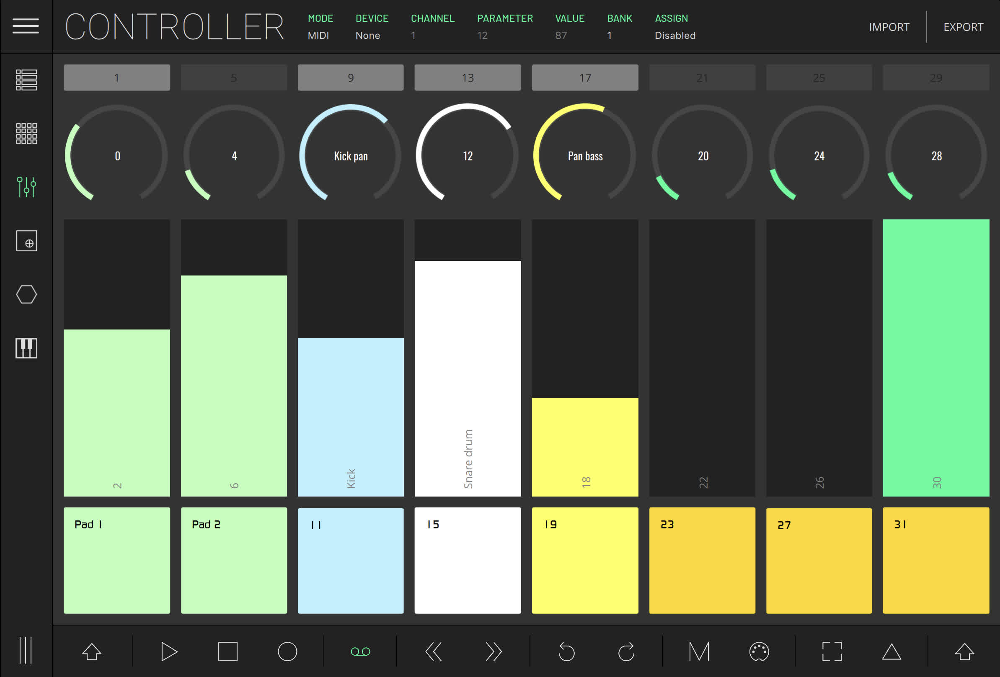

# Midi Controller Module - LK Help

This module is composed of several screen controls distributed through 8 columns per bank; each column has a knob, a button, a fader and a pad.

With four banks available, this means you have 32 programmable controls per bank, to a total of 128.

As all modules it has two modes: the MIDI mode, that can be used to control MIDI (external hardware, apps, etc), and the Live mode, which can be used to control Ableton Live parameters.

Note that these two modes can be used alternatively, giving you the possibility to control Ableton Live and MIDI, each with different channels and control assignments.

Depending on the mode selected, you will find different sections in the status bar at the top of the screen:

- **MODE** - allows toggling between Live and MIDI modes
- **DEVICE (MIDI MODE)** - selects the output MIDI device.
- **CHANNEL (MIDI MODE)** - chooses the MIDI output channel.
- **PARAMETER** - shows the CC number (MIDI MODE) or the Ableton Live parameter (LIVE MODE) of the selected screen control
- **VALUE** - shows the value of data transmitted by the selected screen control.
- **BANK** - switch between the four different banks of controls

By default, the CC values are distributed in an ascending order in each column and bank, from 0 to 127. This means that the first screen control of bank 1 is by default mapped to CC 0, while the last screen control, on bank 4 is by default mapped to CC 127. Nevertheless, all these parameters can be customized, giving you the possibility to adapt this section to your needs.

## Assigning a custom MIDI CC

To customize the MIDI mapping (MIDI mode), tap ASSIGN, then tap the control you wish to change. This will open a pop-up allowing you to edit the name, color, MIDI channel, CC number and min and max values.

To exit mapping mode, tap ASSIGN to change it back to disabled.

To return a control to the default CC mapping, press ASSIGN and then RESET.

## Assigning an Ableton Live Parameter

To customize the parameters in Live mode, select the LK control you want to map, then press ASSIGN. Change the parameter you want to assign in Ableton Live or using the [Matrix](matrix) devices section. The name of the parameter will be displayed on the screen, press OK to confirm.

To exit mapping mode, tap ASSIGN to change it back to disabled.

[Learn all about the XY-Pad Module.](xy-pad)
