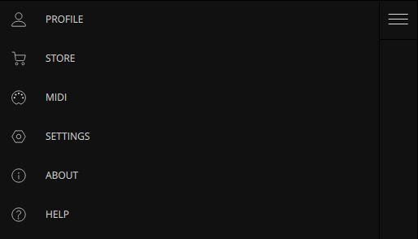

# Settings

<figure style="text-align: center;">
  
  <figcaption style="font-size: 0.9em;">Click the top left icon to display the Menu, where you can find the Settings. Here you can configure the general aspects of your project, such as render output details and active audio devices.</figcaption>
</figure>

- **Window Scale** - Scale the window and UI elements by this factor.
- **Input Audio Device** (Standalone only) - Select audio input device. [Audio Modulators](modulation-sources#audio-modulators) and [Layers](layer-properties#input) will receive audio from this device’s input channels.
- **Output Audio Device** (Standalone only) - Select audio output device. [Audio Player](audio-player) output will play through this device.
- **Sample Rate** (Standalone only)
- **Buffer Size** (Standalone only)
- **Render Output** - Enable NDI, Spout (Windows) or Syphon (Mac) video output.
- **Frame Rate** - Target refresh rate of VS render output.
- **Output Resolution** - The resolution at which the output is rendered. Set to lower resolutions for lighter GPU load. Set to higher resolutions for a more detailed visual output.
- **Portrait Orientation** - Swaps the Output Resolution width and height for a vertical output.
- **Render Quality** - Select Performance for more consistent framerate or High Resolution for the best image quality.
- **Recording**
    - **Quality** - Level of quality/detail of VS's video recordings. The higher the setting, the larger the file size.
    - **Recordings Folder** - Recordings are saved to this folder. Click the folder icon to set a new folder.
- **Voices** - Number of simultaneous polyphonic visual voices per Layer. With 4 polyphonic voices, each Layer can display 4 simultaneous instances of its material.
- **Animated layer thumbnails** - If enabled, Layer thumbnails display a real-time representation of the Layer output.
- **Shaders cache reset** - Resetting the shader cache will force them to recompile on the next reboot. Try if shaders are failing to display.

 

***
**Note** - If the frames per second counter is below the target frame rate, it means that your GPU is not capable of delivering the frame rate you request. If that is the case, you should lower the quality setting until fps reaches your target frame rate.
***

[Previous: Store Panel](store-panel) 
[Next: Shortcuts](shortcuts)